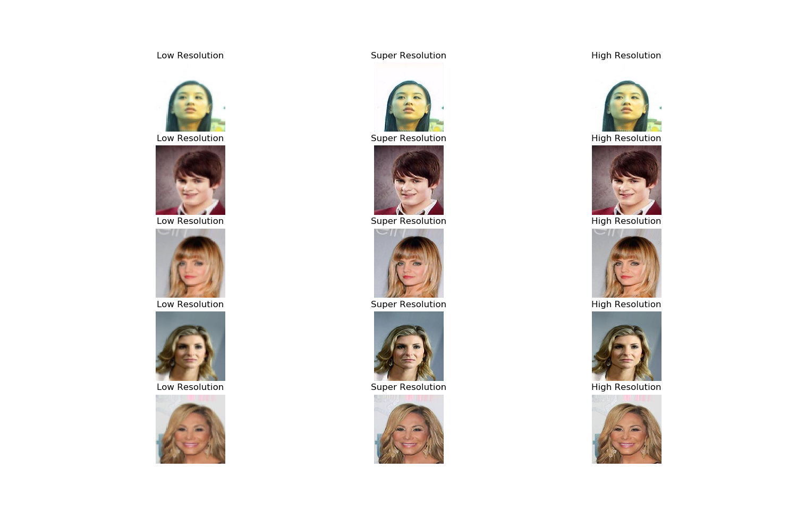
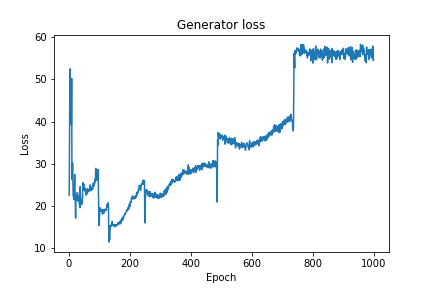
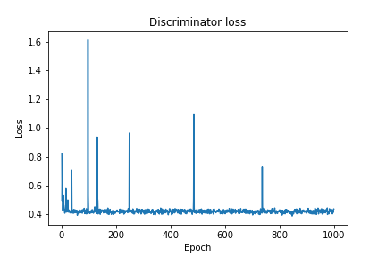
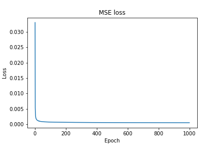
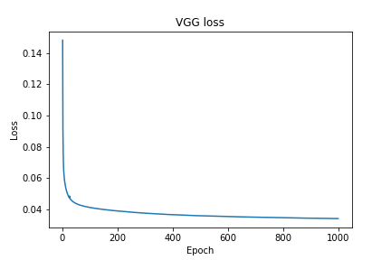

# Download Dataset
Downoad the dataset from [here](https://www.kaggle.com/jessicali9530/celeba-dataset), it consist of about 202k images. After downloading, move that folder in dataset foler.

# Train Network
Once the dataset is downloaded and moved, run:
```
python3 SRGAN.py 
```
It take 5000 examples for training, one can change it to any value under 202k\
Depending upon GPU, one can vary batch size. Since I had single GPU. I trained it on batch size of 16

# Test Network
For testing the network, just run :

```
python3 Test.py
```
It take last five images from the dataset,to produce the SR images. If anyone want to test more images one can chage it to another value

# Results
Left one is Downsampled image, Middle is the SR image produced by Generaor, and right is th HR image or the truth truth


## Loss with epochs
 \
 
